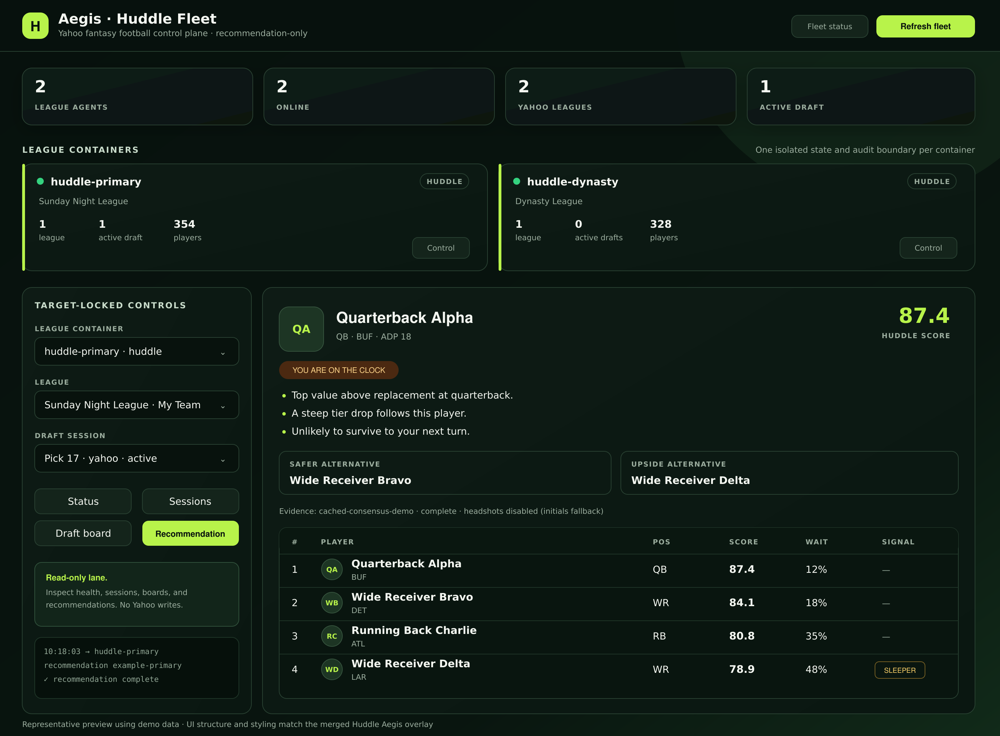

# Huddle Fantasy Agent

Huddle is a read-only fantasy football decision agent for league-specific draft and weekly management. This MVP provides a multi-league portfolio dashboard and live draft rooms that reconcile completed picks and immediately refresh deterministic draft boards. It never submits a Yahoo draft pick.

The public example profile is a six-team, two-quarterback, full-PPR Yahoo league with six-point passing touchdowns. Real league IDs, team names, OAuth references, and commissioner settings belong only in untracked local configuration or a secret manager. Every profile remains configurable and can be verified against Yahoo once OAuth access is approved.

## What works now

- Persistent draft sessions with snake-draft turn calculation.
- Native multi-league registry with league-scoped state, sessions, settings, and dashboard selection.
- Manual completed-pick entry with an import endpoint for structured screenshot/OCR results.
- Balanced, safe, and upside recommendations after every reconciled pick.
- Value above replacement, roster need, positional tier drop, risk, next-turn availability, and early K/DEF discipline.
- Sleeper flags based on Expert Consensus Rank versus ADP and ceiling.
- Cached FantasyPros rankings/projection adapter with explicit truncated-response warnings.
- Read-only Yahoo settings, teams, and draft-results adapter plus an idempotent polling loop.
- Agent-core model routing with an integrity check. Models can explain a computed card but cannot reorder it.
- Aegis-compatible health, color, manifest, status, and allowlisted read-only WebSocket command contracts.
- Huddle-owned Aegis fleet dashboard with target-locked league, session, board, and recommendation controls.
- License-gated player headshots with initials fallback and FantasyPros image-field redaction.
- Optional one-container-per-league fleet generator for one VM with separate state/env/audit volumes.
- Local web dashboard and JSON API.

## Aegis control plane preview



This representative preview uses demo league and player data. It shows the merged Huddle dashboard structure, including league-container health, target-locked controls, an active recommendation, alternatives, evidence status, sleeper signals, and the initials fallback used when licensed headshots are unavailable.

## Quick start

Requirements: Node.js 22 or newer.

```bash
npm install
cp .env.example .env
npm start
```

Open `http://127.0.0.1:8787`. The default dashboard uses synthetic players so no secret is required to exercise the full draft loop.

For native portfolio mode, set `HUDDLE_LEAGUE_REGISTRY=./config/leagues/registry.example.json`. See the [multi-league fleet runbook](docs/multi-league-fleet.md) for one-container and multi-container deployment modes.

In one-container-per-league mode, the fleet generator mounts both the Aegis source clone and the Huddle dashboard read-only. At startup it copies them into Aegis's writable runtime volume, replacing only the runtime `index.html`. The `aegis` repository remains untouched.

Keep real credentials only in `.env` or a deployment secret manager:

```dotenv
FANTASYPROS_API_KEY=...
YAHOO_CLIENT_ID=...
YAHOO_CLIENT_SECRET=...
```

Do not paste API keys into issues, commits, screenshots, or chat messages.

Player images are disabled by default. [FantasyPros states that its Sportradar-licensed player image URLs are not included in the API license](https://support.fantasypros.com/hc/en-us/articles/49749297704475-How-do-I-request-access-to-the-FantasyPros-API), so Huddle strips those fields before caching and never displays them. To connect a separately licensed image provider, follow the [player media policy](docs/player-media-policy.md); adding a host without documented display rights is not sufficient.

## How live draft recommendations work

1. **Before the draft:** Huddle refreshes FantasyPros rankings and projections, caches them for six hours, reconciles player IDs, and computes league-specific replacement levels from the Yahoo roster/scoring configuration.
2. **Observe:** During the draft, the Yahoo read-only poller requests completed draft results every five seconds. Until OAuth is available, the operator records each completed pick in the dashboard. Screenshot analysis can post the same normalized pick events through the import endpoint.
3. **Reconcile:** Every pick event has a stable event ID. Replayed Yahoo responses are ignored, drafted players are removed, and Huddle updates the target roster only when the Yahoo team key matches the configured target team.
4. **Re-rank:** The deterministic engine recalculates the available board from projection value, replacement value, positional scarcity, roster need, risk, and the probability each player survives to the next snake turn.
5. **Display:** The dashboard refreshes every 1.5 seconds and shows one preferred pick, a safer alternative, an upside alternative, a 12-player board, sleeper flags, evidence freshness, and clear warnings for incomplete coverage.
6. **Act:** The user makes the selection in Yahoo. Huddle has no endpoint or provider method that can submit a draft pick.

The ranking step is local and typically completes in milliseconds; Yahoo polling and network latency determine how quickly a completed opponent pick appears. The recommendation remains visible if Yahoo temporarily stalls, while the status/evidence fields show that the state may be stale.

## Is the FantasyPros 50-request free tier enough?

Yes for a personal, single-league MVP if Huddle treats FantasyPros as a cached evidence source rather than a live pick feed. A complete six-position refresh uses up to 12 calls (rankings plus projections for QB, RB, WR, TE, K, and DST). One or two refreshes on draft day fit within 50 calls, and completed picks come from Yahoo rather than FantasyPros.

The bigger free-tier limitation may be **truncated responses**, not the daily count. Huddle marks the pool incomplete whenever the API or headers report truncation and warns the operator to verify the preferred player. Productization or multiple leagues would require a production/commercial FantasyPros license; the public API page describes the free tier as non-production and reserves commercial/redistribution use for a commercial plan.

FantasyPros documents `https://api.fantasypros.com/public/v2/json` as its base URL, the `x-api-key` header, and consensus ranking/projection endpoints on its [official API page](https://www.fantasypros.com/api-data/). Yahoo describes the Fantasy Sports API as providing league, team, and player data through its [developer portal](https://sports.yahoo.com/developer/).

## API

| Method | Route | Purpose |
|---|---|---|
| `GET` | `/health` | Service and safety mode |
| `GET` | `/api/league` | Active normalized league profile |
| `GET` | `/api/leagues` | League fleet and active-session summary |
| `GET` | `/api/leagues/:leagueId` | One normalized league profile |
| `POST` | `/api/leagues/:leagueId/draft/sessions` | Start a league-scoped draft session |
| `GET` | `/api/provider-status` | Credential readiness and evidence coverage |
| `POST` | `/api/draft/sessions` | Start a draft session with `draftSlot` and `sourceMode` |
| `GET` | `/api/draft/sessions/:id/recommendation` | Current decision card and board |
| `POST` | `/api/draft/sessions/:id/picks` | Record one completed pick |
| `POST` | `/api/draft/sessions/:id/import-picks` | Record normalized screenshot/Yahoo pick events |
| `POST` | `/api/data/fantasypros/sync` | Refresh the cached player pool |
| `GET` | `/api/agent-core/route` | Inspect the explanation-only model route |
| `GET` | `/api/fleet/manifest` | Safe Aegis registration/capability contract |
| `GET` | `/api/fleet/status` | Fleet and league readiness summary |
| `GET` | `/health/liveliness` | Aegis/container liveness probe |
| `GET` | `/health/readiness` | Evidence and league readiness probe |

The Aegis WebSocket lane accepts only `status`, `leagues`, `sessions <leagueId>`, `board <leagueId> <sessionId>`, `recommendation <leagueId> <sessionId>`, and `help`. It has no mutating Yahoo, roster, waiver, trade, provisioning, or container-lifecycle command.

Example:

```bash
curl -s http://127.0.0.1:8787/api/draft/sessions \
  -H 'content-type: application/json' \
  -d '{"draftSlot":3,"sourceMode":"manual"}'
```

## Verification

```bash
npm run check
```

`check` first verifies that the vendored agent-core routing module matches its source manifest, then runs the Node test suite.

## Repository map

- `config/leagues/` — normalized Yahoo settings and provenance.
- `src/domain/` — deterministic scoring and snake-draft logic.
- `src/providers/` — read-only FantasyPros and Yahoo boundaries.
- `src/services/` — idempotent draft session and event handling.
- `src/agent-core/` — explanation-only integration policy.
- `public/` — operator dashboard.
- `scripts/` — vendored agent-core plus CLI helpers.
- `docs/` — draft-day runbook and architecture decisions.
- `deploy/fleet/` — single-VM, multi-container fleet template.
- `deploy/aegis/` — Huddle-owned Aegis dashboard overlay; no Aegis source changes.

## Next product increments

1. Complete Yahoo OAuth callback/token refresh and verify every league registry entry against the API.
2. Add Yahoo/FantasyPros player-ID crosswalk coverage tests and a visible unresolved-player queue.
3. Add screenshot upload with attested image parsing and human confirmation before pick ingestion.
4. Add weekly lineup optimization, matchup/injury/bye review, waiver adds/drops, and a first-class `HOLD` outcome.
5. Add multi-user tenancy, encrypted secret storage, observability, notifications, licensing controls, and paid-source entitlement checks before commercial release.
