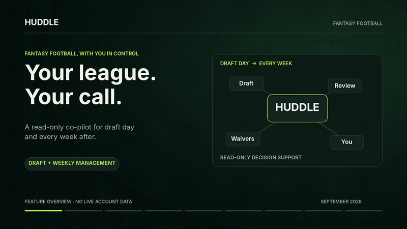
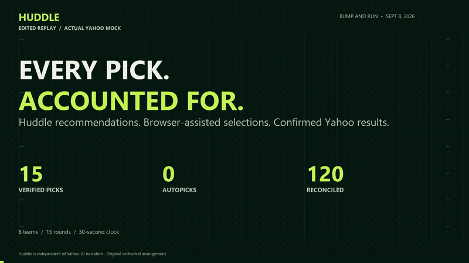
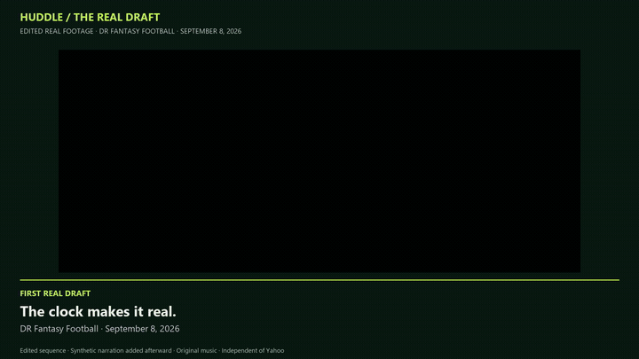
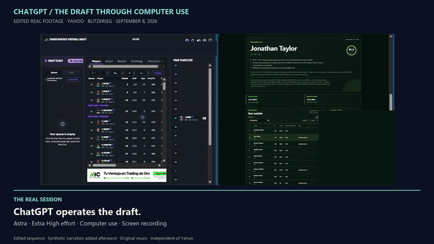

# Huddle Fantasy Agent

A read-only fantasy football assistant for Yahoo drafts and weekly team decisions across multiple leagues. **Huddle recommends; you make every pick, lineup change and waiver claim.**

<!-- HUDDLE-LINKEDIN-VIDEOS:START -->
## Huddle in 60 seconds

[](https://raw.githubusercontent.com/marcusmayo/huddle-fantasy-agent/main/docs/assets/huddle-narrated-landscape-1920x1080.mp4)

**[Watch with sound — 1920 × 1080](https://raw.githubusercontent.com/marcusmayo/huddle-fantasy-agent/main/docs/assets/huddle-narrated-landscape-1920x1080.mp4)** · **[LinkedIn feed — 1080 × 1350](https://raw.githubusercontent.com/marcusmayo/huddle-fantasy-agent/main/docs/assets/huddle-narrated-feed-1080x1350.mp4)** · **[X thread — 1280 × 720](https://raw.githubusercontent.com/marcusmayo/huddle-fantasy-agent/main/docs/assets/huddle-narrated-x-1280x720.mp4)**

September 2026 · AI-generated narration and an original orchestral score. The animated GIF is silent; click it for the video with sound. Feature overview, not live-account footage.

[Captions](docs/assets/huddle-narration-en.srt) · [Media notes and silent originals](docs/media/narrated-previews.md) · [Earlier walkthrough — August 9](docs/assets/huddle-product-demo.mp4) · [Thumbnail](docs/assets/huddle-linkedin-overview-thumbnail.jpg)

**Second narrated preview: [Every pick accounted for](docs/media/draft-replay-preview.md)** — an edited replay of an actual completed Yahoo mock: 15 Huddle-guided selections, zero autopicks, five WRs, four RBs, two QBs and two TEs. Includes the same three video formats and captions. [Final retrospective and draft-night handoff](docs/draft-final-postmortem-2026-09-08.md).
<!-- HUDDLE-LINKEDIN-VIDEOS:END -->

## Narrated draft replay

[](https://raw.githubusercontent.com/marcusmayo/huddle-fantasy-agent/main/docs/assets/huddle-draft-narrated-landscape-1920x1080.mp4)

**[Watch with sound — 1920 × 1080](https://raw.githubusercontent.com/marcusmayo/huddle-fantasy-agent/main/docs/assets/huddle-draft-narrated-landscape-1920x1080.mp4)** · **[LinkedIn feed — 1080 × 1350](https://raw.githubusercontent.com/marcusmayo/huddle-fantasy-agent/main/docs/assets/huddle-draft-narrated-feed-1080x1350.mp4)** · **[X thread — 1280 × 720](https://raw.githubusercontent.com/marcusmayo/huddle-fantasy-agent/main/docs/assets/huddle-draft-narrated-x-1280x720.mp4)**

Watch the second Huddle preview: a 60-second edited replay of the completed Yahoo mock, with Huddle recommendations, synthetic narration and original orchestral music. The animated GIF is silent; click it for the video with sound.

## Huddle's first real draft

Historical footage from September 8, 2026. See [improvements since this live draft](#improvements-since-the-first-live-draft) for the subsequent changes and validation results.

[](https://raw.githubusercontent.com/marcusmayo/huddle-fantasy-agent/main/docs/assets/huddle-real-draft-narrated-landscape-1920x1080.mp4)

**[Watch with sound — 1920 × 1080](https://raw.githubusercontent.com/marcusmayo/huddle-fantasy-agent/main/docs/assets/huddle-real-draft-narrated-landscape-1920x1080.mp4)** · **[LinkedIn feed — 1080 × 1350](https://raw.githubusercontent.com/marcusmayo/huddle-fantasy-agent/main/docs/assets/huddle-real-draft-narrated-feed-1080x1350.mp4)** · **[X thread — 1280 × 720](https://raw.githubusercontent.com/marcusmayo/huddle-fantasy-agent/main/docs/assets/huddle-real-draft-narrated-x-1280x720.mp4)**

Watch Huddle enter the Yahoo draft for Blitzkrieg: 60 seconds of recommendations, reconciliation and an audible, using actual recorded footage with the familiar synthetic voice and original orchestral music. The edit includes the failures that shaped the postmortem. The animated GIF is silent; click it for sound.

[Captions](docs/assets/huddle-real-draft-narration-en.srt) · [Media notes](docs/media/real-draft-previews.md#huddle-the-first-real-draft) · [Thumbnail](docs/assets/huddle-real-draft-preview-poster.jpg)

## ChatGPT runs the draft

[](https://raw.githubusercontent.com/marcusmayo/huddle-fantasy-agent/main/docs/assets/chatgpt-real-draft-narrated-landscape-1920x1080.mp4)

**[Watch with sound — 1920 × 1080](https://raw.githubusercontent.com/marcusmayo/huddle-fantasy-agent/main/docs/assets/chatgpt-real-draft-narrated-landscape-1920x1080.mp4)** · **[LinkedIn feed — 1080 × 1350](https://raw.githubusercontent.com/marcusmayo/huddle-fantasy-agent/main/docs/assets/chatgpt-real-draft-narrated-feed-1080x1350.mp4)** · **[X highlights — 1280 × 720](https://raw.githubusercontent.com/marcusmayo/huddle-fantasy-agent/main/docs/assets/chatgpt-real-draft-narrated-x-1280x720.mp4)**

A 4:10 review of ChatGPT using the computer to draft Blitzkrieg on Yahoo: when it followed Huddle, why it made five audibles, and where execution failed. A different synthetic voice and original electronic score accompany the actual footage, including the user's Gibbs pick, Yahoo's autopick and the draft-grade comparison. The X highlights run 2:10; the animated GIF is silent.

[Full captions](docs/assets/chatgpt-real-draft-narration-en.srt) · [X captions](docs/assets/chatgpt-real-draft-x-narration-en.srt) · [Media notes](docs/media/real-draft-previews.md#chatgpt-the-draft-through-computer-use) · [Thumbnail](docs/assets/chatgpt-real-draft-preview-poster.jpg)

## What it does

| Area | Available in the MVP |
|---|---|
| Drafting | League-specific picks, safer/upside alternatives, snake-draft turns and roster-completion checks |
| Weekly reviews | Scores, standings, lineup risks, transaction history and actual-versus-optimal lineup results |
| Waivers | Add/drop or **HOLD**, expected gain, FAAB/priority guidance, confidence and a five-claim fallback plan |
| Multiple leagues | Separate settings, sessions and history; reorder or recoverably remove leagues; isolate data failures |
| Yahoo connection | OAuth, encrypted token refresh, league discovery, confirmed settings imports and completed-pick auto-sync |
| Operations | Readiness checks, draft restart recovery, shared data caching, health endpoints and optional Aegis fleet controls |

## Draft room


Filter and resize the player board, search beyond the visible rows, and track recent picks. Yahoo picks sync automatically in Yahoo mode; manual entry and confirmed screenshot review remain available. Unmatched players are flagged without stopping later picks. **`READY` does not change a manual session to Yahoo mode; look for `Yahoo sync` in the session header for automatic pick updates.**

**How picks are ranked:** Yahoo controls availability and league rules. FantasyPros contributes **67.5%** and Tank01 **32.5%** of the source-consensus component—not the entire score. Without Tank01, that component uses FantasyPros alone. Sleeper trends break close ties. The engine also considers projected value, roster needs, scarcity, risk and next-turn availability. AI can explain a recommendation but cannot change its order.

Screenshot analysis uses OpenRouter only after **Analyze screenshot**. Review and confirm extracted rows before saving. Images are not stored; availability/roster tags do not change rankings, and missing rows never imply a player is unavailable.

## Weekly management

Select a league and week, then choose **Update week from Yahoo** or import [normalized JSON](config/fixtures/weekly-snapshot.example.json). Updates revise that season/week; earlier weeks remain available.

Review matchups, standings movement, points for/against, bench points and injuries/byes. Search the free-agent board for recommended claims and fallbacks. Each league uses its own scoring, roster and waiver rules.

Scheduled Yahoo reads create expiring previews every 24 hours while Huddle is running. Saving weekly history is an explicit action; automatic previews are not permanent records. Manual imports are not presented as Yahoo-verified data.

## Quick start

Requires **Node.js 22+**.

```bash
npm install
cp .env.example .env
npm start
```

Open `http://127.0.0.1:8787`. The synthetic demo needs no credentials and never syncs with Yahoo. Its example league has six teams, two QBs, full PPR and six-point passing touchdowns. The example registry supports a multi-league demo.

### Connect Yahoo

In your local `.env`, set the Yahoo credentials, registered callback URL and encryption key shown in [.env.example](.env.example), then set `HUDDLE_YAHOO_OAUTH_ENABLED=true`. Add provider keys for live rankings and screenshot analysis. Keep credentials and real league details out of Git.

Choose **Connect Yahoo → Import this league**, confirm the settings, then open **Draft room**. **Draft readiness** appears below the workspace tabs, including during an active draft. It checks automatically for connected, imported Yahoo leagues. Select **Check draft readiness** to rerun it—no terminal required.

**Open a live draft only when the panel shows `READY`.** It checks account access, settings, player identities, data freshness, draft depth and read-only Yahoo access. Blockers and warnings appear separately. Recheck after a restart, settings/data changes, or 15 minutes; review projection warnings and confirm the polling allowance with Yahoo.

Snake drafts and standard/flex/superflex rosters are supported; auction drafts are not. Refresh league settings after commissioner changes. See the [live operations plan](docs/september-8-operations.md) for setup and rehearsal details.

## Verification and limits

```bash
npm run check
```

Run `npm run check` for the current suite, including full drafts and 18-week reviews for league sizes from three through ten teams, plus isolation, OAuth, identity matching, readiness, adaptive roster value, weekly context and browser-controller checks. These are application tests, not production load or security certification.

**Operator check — September 4, 2026:** A screenshot of the running instance showed `READY`, 177/177 player identities mapped, 177 players against 120 required, and passing Yahoo read checks. Projection and polling warnings remained. This verifies the displayed readiness result, not a completed live draft or season.

This is a **personal-use MVP**, not a commercial multi-user service. Before launch: validate each league's first live payload, confirm Yahoo polling/history-retention permissions, and add user isolation, authenticated administration, managed secrets, monitoring and commercial data licenses. There is no fixed league-count limit, but hosted concurrency is not validated. Player photos stay off unless separately licensed.

Next features: external failure notifications and reviewed weekly screenshot imports.

## Documentation

| Need | Guide |
|---|---|
| Draft-day workflow | [Live draft runbook](docs/live-draft-runbook.md) |
| Weekly results and waivers | [Weekly management](docs/weekly-management-runbook.md) |
| Multi-league / Aegis deployment | [Fleet runbook](docs/multi-league-fleet.md) |
| Internals, API routes and provider budgets | [Technical reference](docs/technical-reference.md) · [Architecture](docs/architecture.md) |
| Access, retention and incident handling | [Yahoo safety](docs/yahoo-integration-safety.md) · [Security runbook](docs/security-incident-response.md) |
| Player-image licensing | [Media policy](docs/player-media-policy.md) |

[Improvements since the first live draft](#improvements-since-the-first-live-draft)

## Improvements since the first live draft

The September 8, 2026 live draft exposed missed selections, delayed recommendations and incomplete on-screen evidence. The real-draft videos below document that earlier experience. Since that run, the following improvements have been implemented:

| Area | What changed |
|---|---|
| Recommendation updates | Faster Yahoo polling, pushed workspace updates and connection recovery reduce stale recommendations. |
| Draft clock | Optional built-in screen sharing and local clock recognition track the observed turn and deadline. Recommendations are intended to arrive as soon as possible on any clock, preserving at least ten seconds for a human selection. No browser extension is required. |
| Recommendation visibility | Compact and floating views show preferred, safer and upside choices alongside accepted picks, recent results and the roster. Visibility checks distinguish a calculated recommendation from one actually displayed. |
| Selection reliability | The browser-assisted test controller verifies the exact Yahoo player and enabled Draft button, clears stale searches, recovers manual mode and checks that Yahoo accepted the selection. Uncertain or duplicate inputs stop execution. |
| Reconciliation and recovery | Contiguous result checks, saved decisions and session identity checks protect against missing picks, cross-room updates and lost state after a restart. |
| Player evidence | Stronger injury, projection, season and identity checks protect recommendations from stale or incompatible inputs. |
| Reporting and regression coverage | Downloadable audit reports separate verified results from unknown timing or selection actors. Added tests cover clock recognition, delivery, UI selection and recovery failures. |

**Latest Yahoo result — September 10:** one 30-second-clock mock completed **15/15 manual selections, zero autodrafts and 120/120 reconciled results**, with ChatGPT computer use acting as the human selector. [Read the run results](docs/yahoo-desktop-mock-results-2026-09-10.md).

**What remains unverified:** repeatable clean Yahoo drafts, independent recommendation delivery with the required human time margin, and actual-Yahoo clock/display evidence. The successful mock recorded no verified timely receipts from the compact view. These improvements are implemented; that single run does not validate every feature or guarantee future draft performance.

[Full improvement review and evidence](docs/draft-enhancements-since-real-draft.md) · [Changed-file inventory](docs/draft-enhancement-file-inventory.md). The review also explains why the experimental scoring change was rejected and why weights were not changed to imitate Yahoo's draft grades. Recording remains separate from Huddle.
