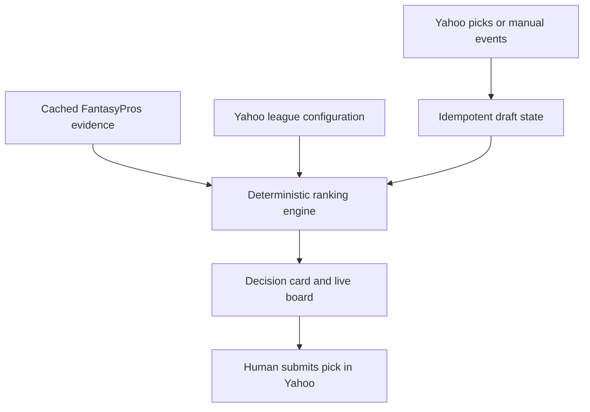

# Architecture and safety boundaries

## Decision pipeline

## Source authority

1. Yahoo league settings and completed draft results are authoritative.
2. FantasyPros rankings and projections are evidence and may be partial.
3. Screenshot extraction is untrusted until a human confirms normalized values.
4. Synthetic fixtures exist only for tests and demonstrations.

## Agent-core boundary

The shared agent-core module chooses an explanation model tier and is protected by a vendored manifest. The ranking engine does not call a model and produces the same ordering for the same inputs. A model may convert the already-computed card into prose; it cannot submit picks, mutate scores, or override source-quality warnings.

## Secret and tenant boundary

- Secrets come from environment variables or a deployment secret manager.
- Tokens and keys are never returned by status endpoints.
- Huddle state is isolated in its own state file and should use its own deployment identity, vault path, and audit stream.
- The Yahoo provider exposes GET methods only in the MVP.

## Productization gates

- Confirm source licenses before paid or multi-user distribution.
- Replace local JSON persistence with tenant-scoped transactional storage.
- Encrypt OAuth refresh tokens and implement revocation.
- Add rate-limit backoff, telemetry, alerting, disaster recovery, and immutable recommendation audits.
- Add explicit consent and confirmation for any future write operation. Draft-pick execution is out of scope.
