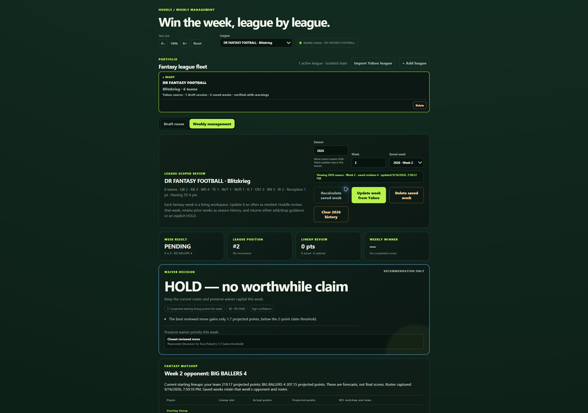
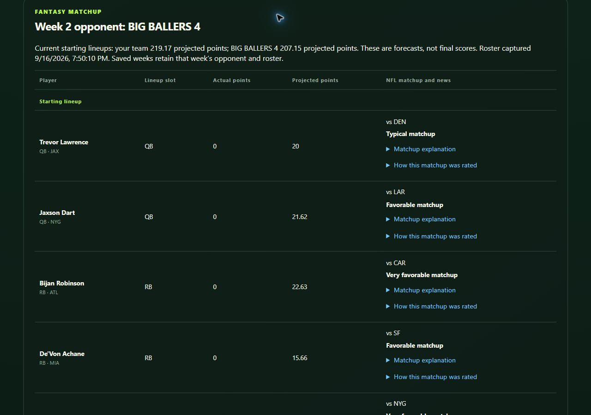
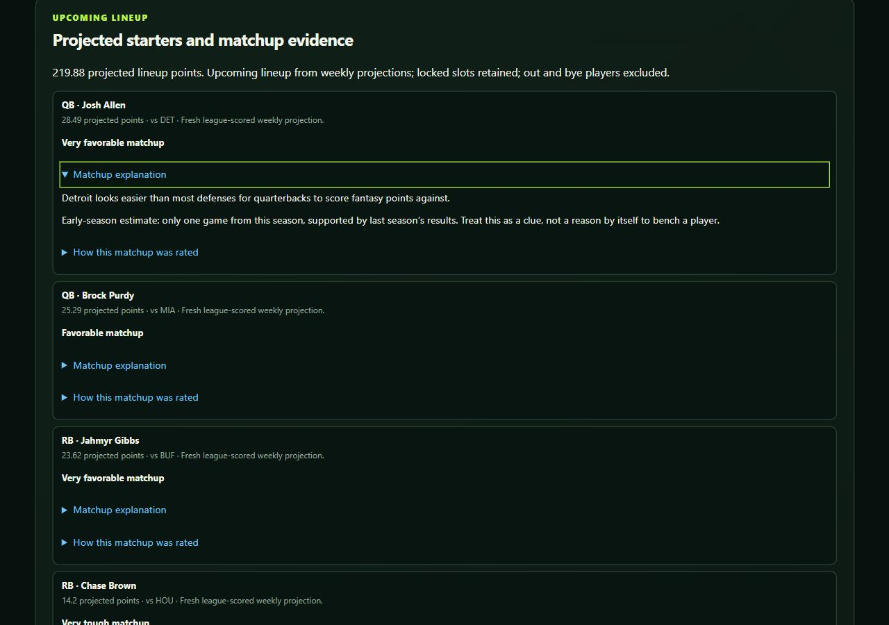
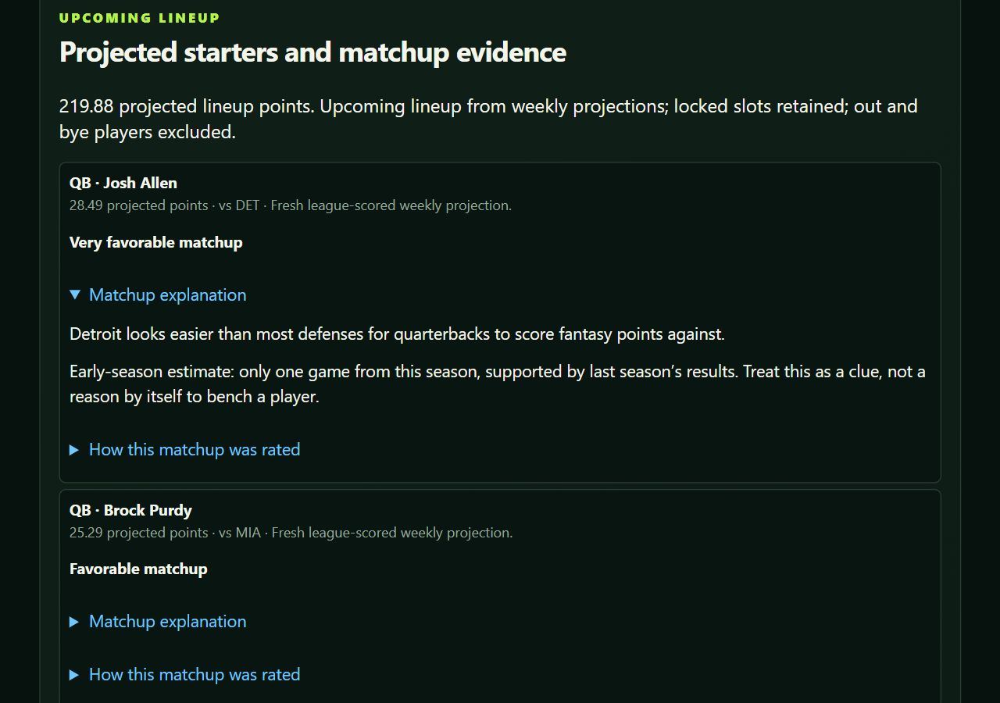
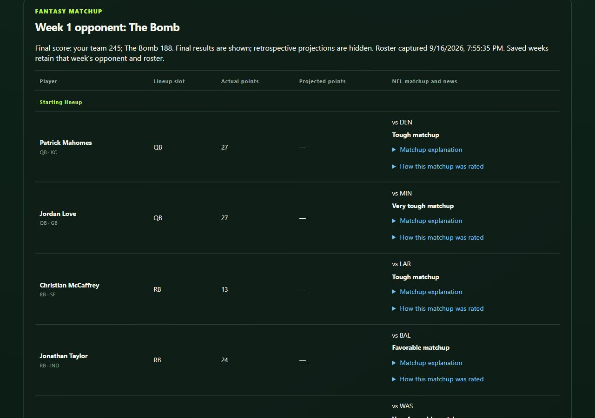

# Weekly management board — September 16, 2026

Actual captures of the running Huddle dashboard during the first management cycle after NFL Week 1. See [the management record](league-management-week-1-2026.md) for recommendations versus implemented moves. The screen shows recommendations, not automatic Yahoo transactions; the Stevenson claim is pending.

## Weekly overview and reading controls

## This week's opponent

## Player matchup explanation

## Larger text

The same player cards at 150% text size.

Text size is saved locally in the browser and ranges from 80% to 200%. Matchup labels remain visible; explanations, rating details and player news expand independently. On narrow screens, tables can scroll inside their panels without widening the page.

## Previous week's opponent

Choose Week 1 in Saved week to see The Bomb's roster and the final 245–188 score. Week 2 keeps its own opponent, BIG BALLERS 4.

